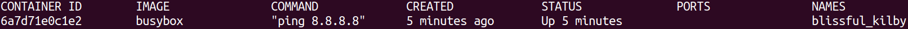
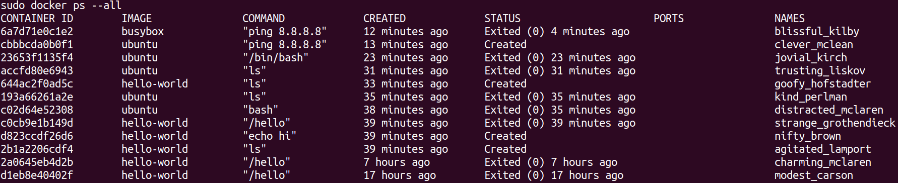

# Manipolare i container

## Creare e avviare un container
``` bash
> (sudo) docker run <nome_immagine> # Crea ed avvia il container usando l'immagine
```
È anche possibile fare un [override](https://it.wikipedia.org/wiki/Override) del comando eseguito all'avvio del container:
``` bash
> (sudo) docker run <nome_immagine> <comando> # All'avvio non uso il comando specificato nell'immagine
# Ad esempio:
> (sudo) docker run busybox ls # Crea l'immagine e fa vedere il File system del container
```
> Se provate `docker run hello-world ls` vi darà errore, perchè **nel container**, più precisamente nel suo FS, **non c'è** un eseguibile che renda sensato il comando 'ls'

## Lista dei container attivi
``` bash
> (sudo) docker ps # Lista dei container che stanno girando sulla macchina
> (sudo) docker ps --all # Lista di tutti i container mai eseguiti ed anche in esecuzione
```
> Da qui si nota una cosa: dopo aver eseguito il container hello-world se uso il comando senza --all non lista nessun container attivo, perchè **appena finisce l'esecuzione del comando il container smette di essere attivo**.<br>
Proviamo quindi a dare il comando `docker run busybox ping 8.8.8.8` e a ridare il comando `docker ps`... il risultato è diverso!




::: tip
Nel campo **NAMES** vi è un nome generato casualmente per identificare il container
:::

## Lifecycle: Ciclo di vita di un container

- Nella fase di **creazione** di un container il FS viene **caricato** nell' Hard Drive.
- Nella fase di **esecuzione** eseguo lo **Startup Command**
``` bash
> (sudo) docker create # Crea il container e soprattutto ne stampa a video l'id
> (sudo) docker start -a <id> # Esegue lo Startup Command del container
```
::: tip
se eseguissimo `docker start` senza **-a** vedremmo a video solo l'id del container, -a quindi specifica a docker di far **ascoltare** al terminale l'output del container.
:::
