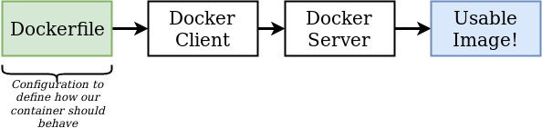
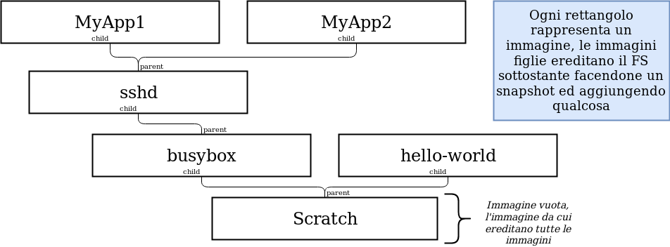
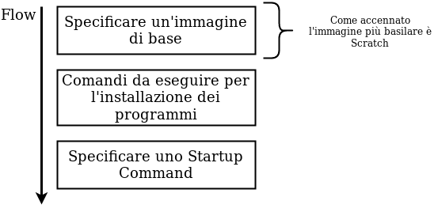

# Immagini custom

## Dockerfiles
Un dockerfile è un **envinronment** descritto in un file di testo, dentro cui si scrivono i **programmi** che compongono la nostra immagine custom ed il **comando iniziale**. 
Fornendo un docker file al Docker Server esso ci restituira un immaggine usabile.

## Image Layers
Le immagini hanno un rapporto **parent-child** (padre-figlio), ovvero un'immagine è creata usandone un altra come **base**. Analizziamone i vantaggi:
- In questo modo è possibile che delle immagini **condividano** dei **nodi**
- Se trovo una vulnerabilità/problema in un nodo la **modularità** dell'immagine mi fa comodo

## Creare un Dockerfile

### Dockerfile: esercitazione

[GO!](./exercise-redis-custom-image.md)

### Processo di creazione nel dettaglio
WIP
