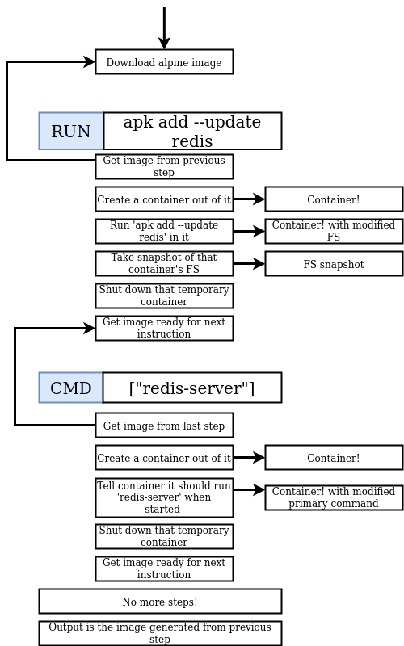
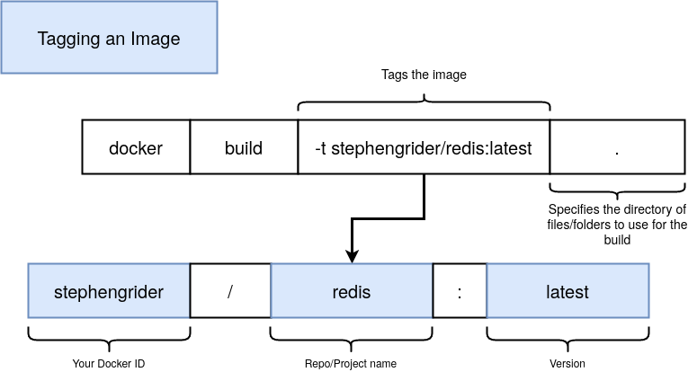

# Immagini custom

## Dockerfiles
Un dockerfile è un **envinronment** descritto in un file di testo, dentro cui si scrivono i **programmi** che compongono la nostra immagine custom ed il **comando iniziale**.<br>
Fornendo un docker file al Docker Server esso ci restituira un immaggine usabile.


## Image Layers
Le immagini hanno un rapporto **parent-child** (padre-figlio), ovvero un'immagine è creata usandone un altra come **base**. Analizziamone i vantaggi:
- In questo modo è possibile che delle immagini **condividano** dei **nodi**
- Se trovo una vulnerabilità/problema in un nodo la **modularità** dell'immagine mi fa comodo


## Creare un Dockerfile


::: tip
È possibile cercare [qui](https://hub.docker.com/search/?type=image) le immagini di base hostate nell'hub, una cosa utile da sapere è che alcune immagini offrono una **versione alpine**, che si impegna ad essere il più minimale possibile (e.g. **node:alpine** è un'immagine compatta con nodeJS)
:::

### Alcuni Comandi
```dockerfile
# Setta la directory attiva, è come una specie di cd di docker
WORKDIR /usr/app

# Copia i file del path 1 nel path 2, dove il path 2 è interno alla futura immagine
COPY ./ ./
```

### Dockerfile: esercitazione

[GO!](./exercise-redis-custom-image.md)

#### Processo di creazione nel dettaglio
Ogni riga del dockerfile si traduce in un immagine, usata per raggiungere il risultato.
> Se aggiungessimo ad esempio una riga per installare, ad esempio, gcc (compilatore C++), avremmo un'altra immagine intermedia.

Come possiamo vedere dallo screen dell'esercitazione dal passagio 2/3 una volta fatto girare il processo interessato l'**immagine intermedia** viene terminata.
::: tip
Come visto anche precedentemente in caso di rebuild la **cache** del docker hub ci aiuta, non dovendo scaricare le immagini.<br>
la novità è che anche le nostre **immagini custom** intermedie sono cachizzate.
:::
::: warning
Se invece invertissimo l'ordine degli step intermedi la cache non servirebbe, dato che le immagini intermedie sarebbero leggermente **diverse**
:::



### Assegnare un tag
```sh
(sudo) docker build -t name . # Builda l'immagine ed associa un tag
(sudo) docker run name # Il tag può essere usato al posto dell'id
```

#### Naming conventions



## Generazione manuale di immagini
Tramite `docker commit` è possibile fare manualmente degli **snapshot** dello stato di un container che sta girando sulla macchina.
```sh
(sudo) docker commit -c 'CMD ["comando di avvio"]' <id>
```
::: warning
È SEMPRE preferibile l'approccio con Dockerfile
:::
