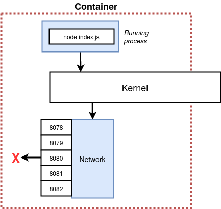

# Docker compose
Prendiamo una situazione di esempio: si vuole far **comunicare 2 container**, uno con un server Node ed uno con Redis per avere una cache solida di alcuni valori.<br>
**Codice di riferimento**: [`Download here`](/assets/sample-app.zip)



Le opzioni per **connettere** questi container sono 2:<br>
1. usare le **feature di networking** della Docker CLI e rendere disponibili le porte necessarie
2. usare **Docker Compose**

## What is
Docker compose è una **CLI separata**, usata per far **partire più container allo stesso tempo** ed **automatizzando** alcuni processi, come ad esempio gli argomenti passati a `docker run` da terminale.

## docker-compose.yml
Analogamente al Dockerfile in questo file vanno descritte le azioni che dovra svolgere `docker compose`
```yml
version: 3
services: # service = image = container
  redis-server:
    image: 'redis'
  node-app:
    build: .
    ports:
      - "3000:8080" # Espongo la porta 3000 all'esterno, sulla 8080
```
```sh
(sudo) docker-compose up # Fa partire i vari container
(sudo) docker-compose up -d # Fa partire i vari container in background
(sudo) docker-compose up --build # Crea anche le immagini
(sudo) docker-compose down # Stoppa i vari container
```
> Semplicemente scrivendo questo `docker compose` crea i container essenzialmente nella stessa rete, la **comunicazione** tra i due container è quindi aperta

::: tip
Se all'interno di una qualsiasi applicazione bisogna riferirsi con URL/URI ad un servizio è possibile usare il nome che esso ha nel file yml (e.g. per riferirsi a redis `host: 'redis-server'`) 
:::

## Container Maintenance con Compose
Compose fornisce delle **politiche di restart** dei container in caso essi dovessero smettere di funzionare/fossero interrotti per qualche ragione:<br>
**Restart options**
- **no**: (default) Compose non prova **mai** a far ripartire il container.
- **always**: Compose prova **sempre** a far ripartire il container.
- **on-failure**: Compose prova a far ripartire il container **solo se** è terminato con un **error-code**.
- **unless-stopped**: Compose prova **sempre** a far ripartire il container **tranne se è il developer** a fermarlo. (`docker stop`)
```yml
...
services:
  service1:
    restart: alway
    ...
  service2:
    restart: on-failure
    ...
  ...
```
```sh
(sudo) docker-compose ps # Stampa lo stato dei container gestiti nel file docker-compose.yml
```
